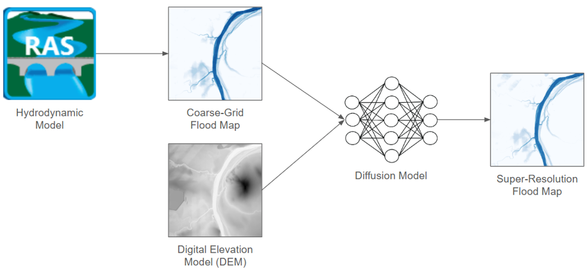

# Physics Informed Generative AI for High Resolution Flood Mapping
## Abstract
Traditional hydrodynamic models generate high-resolution flood maps through fine-grid discretization; however, these models are computationally intensive and impractical for real-time applications. In this report, we propose a novel approach that leverages diffusion models to perform super-resolution on coarse-grid flood maps, with the objective of achieving the accuracy of fine grid flood maps while significantly reducing inference time. Our experimental results demonstrate that diffusion models can substantially decrease the computational time required to produce high-fidelity flood maps without compromising on accuracy. Moreover, diffusion models exhibit superior generalizability across different catchments, with transfer learning further accelerating adaptation to new geographic regions. Finally, by incorporating physics-informed inputs into the model, our approach addresses the common limitation of black-box behavior in machine learning, thereby enhancing interpretability.


<p style="text-align: center;">Figure 1: High level overview of the process</p>

## Pretrained models
This section contains the latent diffusion model checkpoints. `_gen.pth` files contain the model parameters and are needed for inference, while `_opt.pth` files contain the saved optimizer and are needed for further transfer learning. The pretrained autoencoder checkpoint can be found [here](https://drive.google.com/drive/folders/1OurEy9H589z9jXHj-cXtZ1pfyUcCQlIJ?usp=sharing).

| Training Catchment | CG-FG MSE | SR-FG-MSE | % change | Download |
| :----------------: | :-------: | :-------: | :------: | :------: |
| Wollombi | 344.2 | 33.7 | -90.19 | [checkpoint](https://drive.google.com/drive/folders/1lu39Zfs-wA01czTXvnoOOI5LSeClRZk2?usp=sharing) |
| Burnett | 5957.4 | 731.2 | -87.73 | [checkpoint](https://drive.google.com/drive/folders/1mp4n1uPkRVhe27OpUUnkoE726Wx2agYL?usp=sharing) |
| Chowilla | 158.7 | 16.8 | -89.40 | [checkpoint](https://drive.google.com/drive/folders/1m5hnVxXkf6R8kkpJbeKljij_TqobRqSf?usp=sharing) |

After downloading the model checkpoints, edit the appropriate variables in the config file:
```json
"resume_state": "/path/to/pretrained/model",
"vae_state": "/path/to/pretrained/vae",
"vae_dem_state": "/path/to/pretrained/dem/vae"
```
Do not include the `_gen.pth`/`_opt.pth` in the path to the pretrained LDM, the parser will autorimatically detect both files as long as they are in the same directory.

## Requirements
Python 3.10.12+
```
pip install -r requirements.txt
```

## Config
Different configuration options for training and testing of models are specified in a json file and can be passed into the training/testing command via a command-line argument. The `config` directory contains config files for reference, including examples of a [standard diffusion model](config/wollombi-5-01norm.json) and a [latent diffusion model](config/wollombi-trnf.json). 

2 diffusion model architectures are available in this codebase, adapted from the [SR3](https://arxiv.org/abs/2104.07636) and [DDPM](https://arxiv.org/abs/2006.11239) papers. The desired model architecture can be selected using the `which_model_G` variable in the config file. It is recommended to use the sr3 architecture for standard diffusion models and the ddpm architecture for latent diffusion models.

## Catchment data structure
Catchment data should be stored in this folder structure:
```
.
└── catchment_name/
    ├── train_hr/
    │   ├── Box_1_Depth_2021_03_18_00_00_00.tiff
    │   ├── Box_1_Depth_2021_03_18_00_30_00.tiff
    │   └── ...
    ├── train_lr/
    │   ├── Box_1_Depth_2021_03_18_00_00_00.tiff
    │   ├── Box_1_Depth_2021_03_18_00_30_00.tiff
    │   └── ...
    ├── test_hr/
    │   ├── Box_1_Depth_2015_04_21_00_00_00.tiff
    │   ├── Box_1_Depth_2015_04_21_00_30_00.tiff
    │   └── ...
    ├── test_lr/
    │   ├── Box_1_Depth_2015_04_21_00_00_00.tiff
    │   ├── Box_1_Depth_2015_04_21_00_30_00.tiff
    │   └── ...
    └── cropped_dems/
        ├── BOX_1_DEM.tiff
        ├── BOX_2_DEM.tiff
        └── ...
```

## Training
Training is done with the following command:
```
python sr.py -p train -c config.json -output-dir path/to/output/dir
```
The model checkpoints will be stored in the output directory.

## Testing
Testing is done with the following command:
```
python sr.py -p test -c config.json -output-dir path/to/output/dir
```
The super-resolution model outputs will be saved in the output directory if the corresponding option is set in the config file.

## Acknowledgements
Code was adapted from [this implementation](https://github.com/Janspiry/Image-Super-Resolution-via-Iterative-Refinement/tree/master) of [Image Super-Resolution via Iterative Refinement](https://arxiv.org/pdf/2104.07636)